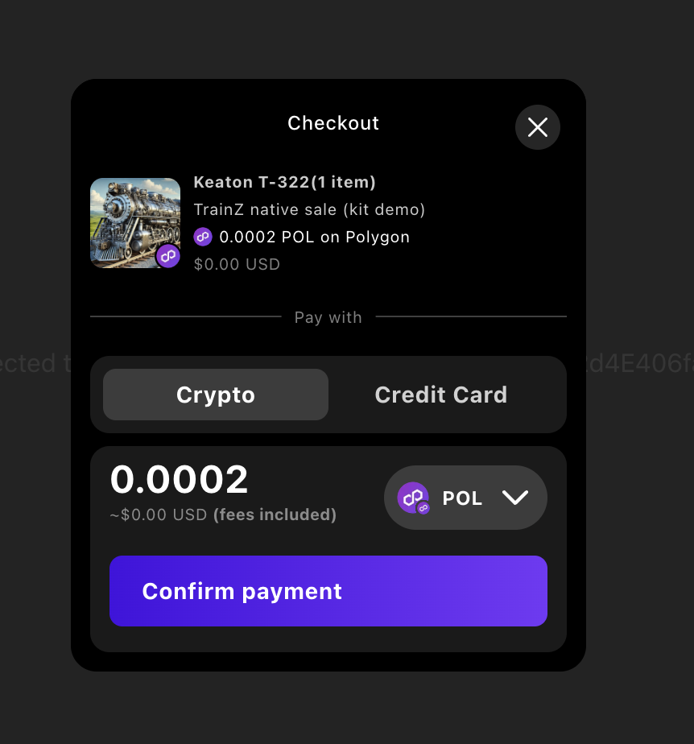

# Sequence Checkout SDK

[@0xsequence/checkout](https://www.npmjs.com/package/@0xsequence/checkout/v/0.0.0-20250924112110) provides a seamless and flexible payment experience for interacting with NFTs, cryptocurrencies, and fiat currencies. It supports multiple payment options, including cryptocurrency transfers, currency swaps, and even credit card payments for whitelisted contracts.

## Key Features

- **NFT Checkout**: Buy NFTs using either the main currency (e.g., ETH), a swapped currency, or a credit card.
- **Currency Swap**: Swap one token for another before completing the transaction.
- **Fiat Onramp**: Onboard users with fiat currency to interact with the blockchain.

# Quickstart

1. First make sure you have installed and setup [@0xsequence/connect](https://www.npmjs.com/package/@0xsequence/connect/v/0.0.0-20250924112110)

2. Install the package:
```bash
npm install @0xsequence/checkout
# or
pnpm install @0xsequence/checkout
# or
yarn add @0xsequence/checkout
```

3. Wrap your app with the SequenceCheckoutProvider.

```typescript [main.tsx]
import { SequenceCheckoutProvider } from '@0xsequence/checkout'

const App = () => {
  return (
    <SequenceConnect config={config}>
      <SequenceCheckoutProvider>
        <Page />
      </SequenceCheckoutProvider>
    </SequenceConnect>
  )
}
```

# NFT Checkout (Sequence Pay)

<div align="center" style="width: 50%; height: 50%;">
  
</div>

Sequence Pay Checkout allows users to purchase NFTs using various payment methods. Users can pay with the main currency (e.g., ETH), swap tokens for payment, or use a credit card provided the smart contract is whitelisted (contact a member of the Sequence team to whitelist your contract for credit card payments).

### For more information, please visit the [Checkout SDK documentation](https://docs.sequence.xyz/sdk/web/checkout-sdk/getting-started).