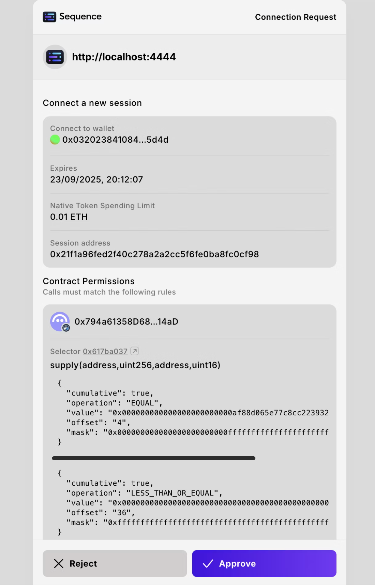

# Sequence Connect SDK

[@0xsequence/connect](https://www.npmjs.com/package/@0xsequence/connect/v/0.0.0-20250924112110) v6 is the React Hooks SDK for the Ecosystem Wallet. It combines social auth, passkeys, account recovery, wallet linking, sessions and permissions management to deliver a complete Web2 like experience for your users. With a small bundle size, it’s the fastest way to add a complete, non-custodial ecosystem smart wallet experience to your DApp.

## Key Features

- Social auth (Email, Google, Apple)
- Passkeys
- Account Recovery
- Wallet Linking
- Smart sessions management
- Customizable theming
- Built in UI components

# Quickstart

1. Install the package:
```bash
npm install @0xsequence/connect
# or
pnpm install @0xsequence/connect
# or
yarn add @0xsequence/connect
```

2. Create the wallet configuration

```typescript [config.ts]
import { createConfig, createContractPermission } from "@0xsequence/connect";
import { parseEther, parseUnits } from "viem";

export const USDC_ADDRESS_ARBITRUM = '0xaf88d065e77c8cC2239327C5EDb3A432268e5831'
export const AAVE_V3_POOL_ADDRESS_ARBITRUM = '0x794a61358D6845594F94dc1DB02A252b5b4814aD'

export const config: any = createConfig({
  projectAccessKey: "AQAAAAAAAABtDHG1It7lxRF_9bbxw4diip8",
  signIn: {
    projectName: 'Sequence Web SDK Demo',
  },
  walletUrl: 'https://next-acme-wallet.sequence-dev.app/',
  dappOrigin: window.location.origin,
  appName: 'Sequence Web SDK Demo',
  chainIds: [42161],
  defaultChainId: 42161,
  google: true,
  apple: true,
  email: true,
  explicitSessionParams: {
    chainId: 42161,
    nativeTokenSpending: {
      valueLimit: parseEther('0.01'), // Allow spending up to 0.01 ETH for gas fees
    },
    expiresIn: {
      hours: 24, // Session lasts for 24 hours
    },
    permissions: [
      createContractPermission({
        address: AAVE_V3_POOL_ADDRESS_ARBITRUM,
        functionSignature: 'function supply(address asset, uint256 amount, address onBehalfOf, uint16 referralCode)',
        rules: [
          {
            param: 'asset',
            type: 'address',
            condition: 'EQUAL',
            value: USDC_ADDRESS_ARBITRUM
          },
          {
            param: 'amount',
            type: 'uint256',
            condition: 'LESS_THAN_OR_EQUAL',
            value: parseUnits('100', 6), // Max cumulative amount of 100 USDC
            cumulative: true
          }
        ]
      })
    ]
  }
});
```

3. Wrap your app with the SequenceConnect provider.

```typescript [main.tsx]
import React from "react";
import ReactDOM from "react-dom/client";
import "./index.css";

import App from "./App";
import { config } from "./config";
import { SequenceConnect } from "@0xsequence/connect";

function Dapp() {
  return (
    <SequenceConnect config={config}>
      <App />
    </SequenceConnect>
  );
}

ReactDOM.createRoot(document.getElementById("root")!).render(
  <React.StrictMode>
    <Dapp />
  </React.StrictMode>
);
```

4. Trigger the connection modal

```typescript [App.tsx]
import './App.css'
import { useOpenConnectModal } from '@0xsequence/connect'

function App() {
  const {setOpenConnectModal} = useOpenConnectModal()
  
  return (
    <>
      <button onClick={() => setOpenConnectModal(true)}>Connect</button>
    </>
  )
}

export default App
```

<div align="center" style="width: 50%; height: 50%;">
  
</div>

### For more information, please visit the [Connect SDK documentation](https://docs.sequence.xyz/sdk/web/wallet-sdk/ecosystem/getting-started).