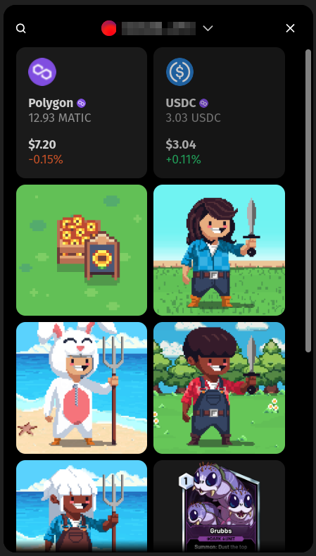

# Sequence Web SDK Wallet

<div align="center">
  
</div>

Embedded wallet allowing to display and send collectibles and coins.

# Installing the module

First install the package:

```bash
npm install @0xsequence/web-sdk-wallet
# or
pnpm install @0xsequence/web-sdk-wallet
# or
yarn add @0xsequence/web-sdk-wallet
```

Then the wallet provider module must placed below the Sequence Web SDK Core provider.

```js
import { KitWalletProvider } from '@0xsequence/web-sdk-wallet'

const App = () => {
  return (
    <SequenceKit config={config}>
      <KitWalletProvider>
        <Page />
      </KitWalletProvider>
    </WagmiProvider>
  )
}
```

# Opening the embedded wallet

The embedded wallet modal can be summoded with the `useOpenWalletModal` hook.

```js
import { useOpenWalletModal } from '@0xsequence/web-sdk-wallet'

const MyComponent = () => {
  const { setOpenWalletModal } = useOpenWalletModal()

  const onClick = () => {
    setOpenWalletModal(true)
  }

  return <button onClick={onClick}>open wallet</button>
}
```
